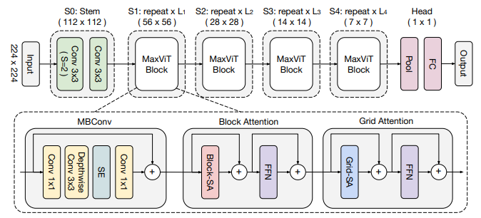

# MaxViT: Multi-Axis Vision Transformer

Unofficial **PyTorch** reimplementation of the
paper [MaxViT: Multi-Axis Vision Transformer](https://arxiv.org/pdf/2204.01697.pdf)
by Zhengzhong Tu et al. (Google Research).

<p align="center">
  
</p>

Figure taken from [paper](https://arxiv.org/pdf/2204.01697.pdf).

## Installation

You can simply install the MaxViT implementation as a Python package by using `pip`.

```shell script
pip install git+https://github.com/ChristophReich1996/MaxViT
```

Alternatively, you can clone the repository and use the implementation in [maxvit](maxvit) directly in your project.

This implementation only relies on PyTorch and [Timm](https://github.com/rwightman/pytorch-image-models) (
see [requirements.txt](requirements.txt)).

## Usage

This implementation provides the pre-configured models of the paper (tiny, small, base, and large 224 X 224), which can
be used as:

```python
import torch
import maxvit

# Tiny model
network: maxvit.MaxViT = maxvit.max_vit_tiny_224(num_classes=1000)
input = torch.rand(1, 3, 224, 224)
output = network(input)

# Small model
network: maxvit.MaxViT = maxvit.max_vit_small_224(num_classes=365, in_channels=1)
input = torch.rand(1, 1, 224, 224)
output = network(input)

# Base model
network: maxvit.MaxViT = maxvit.max_vit_base_224(in_channels=4)
input = torch.rand(1, 4, 224, 224)
output = network(input)

# Large model
network: maxvit.MaxViT = maxvit.max_vit_large_224()
input = torch.rand(1, 3, 224, 224)
output = network(input)

```

To accesses the named weights of the network which are not recommended being used with weight decay
call `nwd: Set[str] = network.no_weight_decay()`.

In case you want to use a custom configuration you can use the `MaxViT` class. The constructor method takes the
following parameters.

| Parameter | Description | Type |
| ------------- | ------------- | ------------- |
| in_channels | Number of input channels to the convolutional stem. Default 3 | int, optional |
| depths | Depth of each network stage. Default (2, 2, 5, 2) | Tuple[int, ...], optional |
| channels | Number of channels in each network stage. Default (64, 128, 256, 512) | Tuple[int, ...], optional |
| num_classes | Number of classes to be predicted. Default 1000 | int, optional |
| embed_dim | Embedding dimension of the convolutional stem. Default 64 | int, optional |
| num_heads | Number of attention heads. Default 32 | int, optional |
| grid_window_size | Grid/Window size to be utilized. Default (7, 7) | Tuple[int, int], optional |
| attn_drop | Dropout ratio of attention weight. Default: 0.0 | float, optional |
| drop | Dropout ratio of output. Default: 0.0 | float, optional |
| drop_path | Dropout ratio of path. Default: 0.0 | float, optional |
| mlp_ratio | Ratio of mlp hidden dim to embedding dim. Default: 4.0 | float, optional |
| act_layer | Type of activation layer to be utilized. Default: nn.GELU | Type[nn.Module], optional |
| norm_layer | Type of normalization layer to be utilized. Default: nn.BatchNorm2d | Type[nn.Module], optional |
| norm_layer_transformer | Normalization layer in Transformer. Default: nn.LayerNorm | Type[nn.Module], optional |
| global_pool | Global polling type to be utilized. Default "avg" | str, optional |

## Disclaimer

This is a very experimental implementation only based on the [MaxViT paper](https://arxiv.org/pdf/2204.01697.pdf). Since
an official implementation of the MaxViT is not yet published, it is not possible to say to which extent this
implementation might differ from the original one. If you have any issues with this implementation please raise an
issue.

## Reference

```bibtex
@article{Liu2021,
    title={{MaxViT: Multi-Axis Vision Transformer}},
    author={Tu, Zhengzhong and Talebi, Hossein and Zhang, Han and Yang, Feng and Milanfar, Peyman and Bovik, Alan 
            and Li, Yinxiao}
    journal={arXiv preprint arXiv:2204.01697},
    year={2022}
}
```
